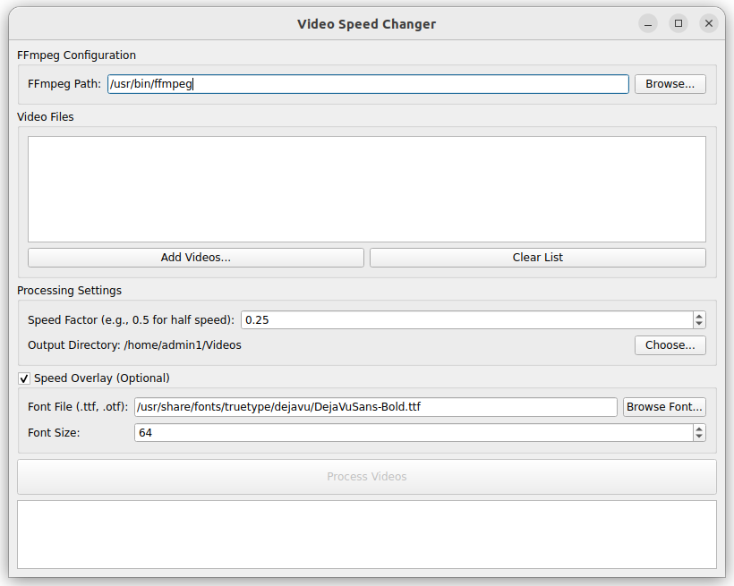

# Simple Video Speed Changer

A simple video speed changer application built with Qt6 and ffmpeg.

This application was generated by Gemini 2.5 Pro.




## Tested On
- Ubuntu 22.04
- GCC 12.3.0
- Qt 6.6.2

## Build

```bash
mkdir build && cd build
# Replace <QT DIR> with your Qt installation path (e.g. /home/user/Qt/6.6.2/gcc_64/)
cmake .. -DCMAKE_PREFIX_PATH=<QT DIR>
cmake --build . --config Release
```

Alternatively, open the project with Qt Creator and build it from the GUI.